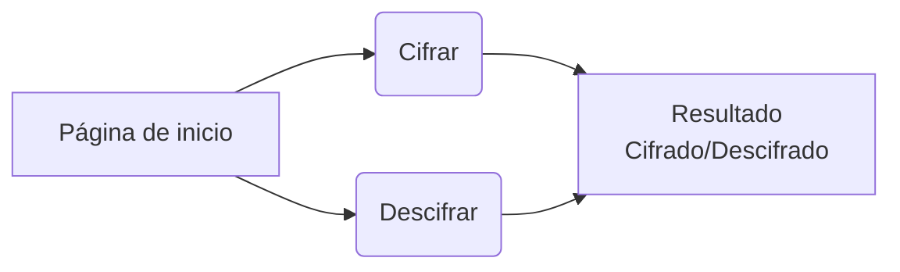
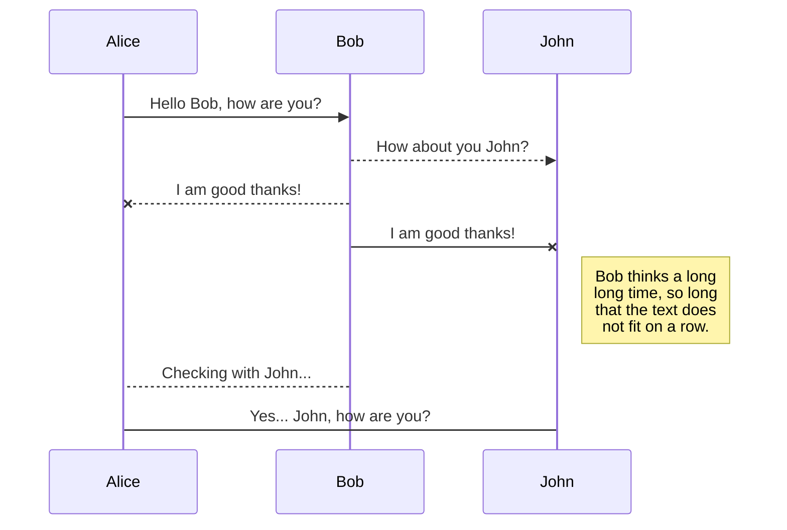

# CifraSafe

Bienvenido a CifraSafe, la mejor aplicación para cifrar sus contraseñas. A continuación se expondrá el funcionamiento de la aplicación, a quién está dirigido, los objetivos del usuario en relación con el producto, y qué problemas resuelve esta aplicación.

Hello, bienvenid@ a la información sobre la aplicación de CiferSafe.  
Aqui explicaremos el funcionamiento, el público al que está dirigido, los objetivos del usuario en relación al producto, y qué problemas resuelve esta aplicación.   

* Versión disponible [Inglés](https://github.com/LewisVo/Markdown-Tutorial/blob/master/Translation:Spanish.md).

*******
Indice de contenidos  
 1. [What is Markdown?](#whatismarkdown)
 2. [Why use Markdown?](#why)
 3. [Tools for Markdown](#tools)
 4. [Markdown Syntax](#syntax)

*******

### Instalación

*  `README.md`: debe explicar cómo descargar, instalar y ejecutar la aplicación así como una introducción a la aplicación, su funcionalidad y decisiones de diseño que tomaron.

### Decisiones de Diseño

* [ ] `README.md` incluye info sobre proceso y decisiones de diseño.

#### Definición del producto

A continuación se presenta como se pensó en los usuarios y el proceso para definir el producto final a nivel de experiencia y de interfaz.

## ¿A quién está dirigido?

En un ambiente cambiante, y con alta vulnerabilidad, es que se hace cada vez más necesario tener un modo de mejorar la seguridad de las contraseñas utilizadas.  

Esta aplicación esta dirigida a particulares y empresas que quieran mejorar la seguridad de sus contraseñas de acceso, por ej.: contraseñas de correo, contraseñas de acceso a los computadores de escritorio, contraseñas de carpetas con archivos relevantes, entre otros.

Tener un sistema de codificación contribuye a dar seguridad al espacio personal y de trabajo.

  
## ¿Cuáles son los objetivos del usuario al usar CifraSafe?

* [ ] `README.md` explica claramente cómo el producto soluciona los problemas/necesidades de los usuarios.

Mejorar la seguridad de las contraseñas digitales tanto personales como institucionales de las personas.

Los objetivos del usuario son en relación a la creación de contraseñas cifradas mediante el código césar. Los pasos que deben realizar para lograrlo son:

1. Ingresar a la página.

2.  Seleccionar si quieren cifrar o descifrar una contraseña.

3. En el area de texto escribir o pegar la contraseña a Cifrar/Descifrar.

4. Indicar el número de cifrado.

5. El resultado se verá inmediatamente en la sección contigua.

7. Listo para usar!

  

## ¿Cómo resuelve los problemas del usuario?

  
  

#### Interfaz de usuario (UI)

  

La interfaz permite al usuario:

- Elegir un desplazamiento (_offset_) indicando cuántas posiciones queremos que el cifrado desplace cada caracter.

- Insertar un mensaje (texto) que queremos cifrar.

- Ver el resultado del mensaje cifrado

- Insertar un mensaje (texto) a descifrar.

- Ver el resultado del mensaje descifrado.

### ¿Cómo funciona?
  
CiferSafe cifra mediante Cipher Cesar. El cifrado césar es una de las técnicas más simples para cifrar un mensaje. Es un tipo de cifrado por sustitución, es decir que cada letra del texto original es reemplazada por otra que se encuentra un número fijo de posiciones (desplazamiento) más adelante en el mismo alfabeto.

Por ejemplo, si usamos un desplazamiento (_offset_) de 3 posiciones:

- La letra A se cifra como D.

- La palabra CASA se cifra como FDVD.

- Alfabeto sin cifrar: A B C D E F G H I J K L M N O P Q R S T U V W X Y Z.

- Alfabeto cifrado: D E F G H I J K L M N O P Q R S T U V W X Y Z A B C

Usa este alfabeto simple (mayúsculas y minúsculas, sin ñ ni caracteres especiales):

- A B C D E F G H I J K L M N O P Q R S T U V W X Y Z

- a b c d e f g h i j k l m n o p q r s t u v w x y z

  

## Recursos y temas relacionados

  

  

  

  
## Diseño de experiencia de usuario (User Experience Design):

- Ideación.

- Prototipado (sketching)

Diagrama de flujo de .......:

## Testeo e Iteración

Desarrollo Front-end:

* Valores

* Tipos

* Variables

* Control de flujo

* Tests unitarios

Herramientas:

- GitHub y GitHub Pages.

## Contribuciones

Pull requests and stars are always welcome. For bugs and feature requests, please create an issue. But before doing anything, please read the CONTRIBUTING.md guidelines.

## UML diagrams

 

  

