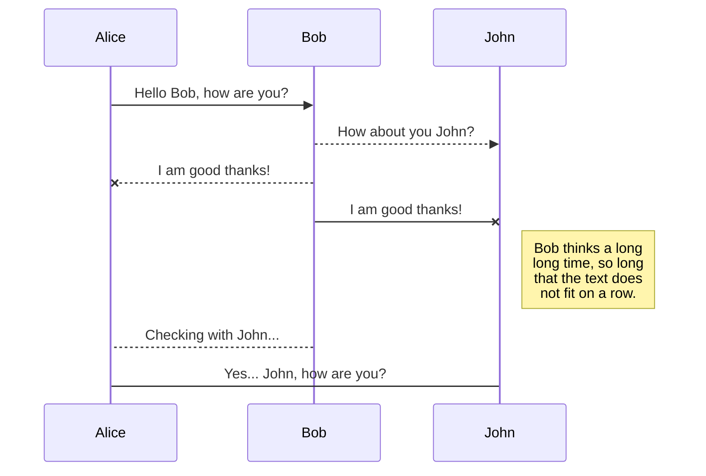
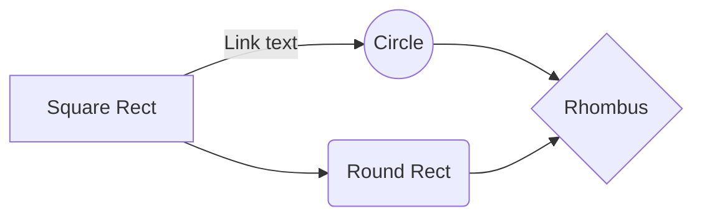

# CifraSafe

  
Bienvenido a CifraSafe, la mejor aplicación para cifrar sus contraseñas.

### ¿Cómo funciona?

CiferSafe cifra mediante Cipher Cesar. El cifrado césar es una de las técnicas más simples para cifrar un mensaje. Es un tipo de cifrado por sustitución, es decir que cada letra del texto original es reemplazada por otra que se encuentra un número fijo de posiciones (desplazamiento) más adelante en el mismo alfabeto.

Por ejemplo, si usamos un desplazamiento (_offset_) de 3 posiciones:

- La letra A se cifra como D.

- La palabra CASA se cifra como FDVD.

- Alfabeto sin cifrar: A B C D E F G H I J K L M N O P Q R S T U V W X Y Z.

- Alfabeto cifrado: D E F G H I J K L M N O P Q R S T U V W X Y Z A B C
- 
Usa este alfabeto simple (mayúsculas y minúsculas, sin ñ ni caracteres especiales):

- A B C D E F G H I J K L M N O P Q R S T U V W X Y Z
- a b c d e f g h i j k l m n o p q r s t u v w x y z

  
#### Definición del producto

A continuación presenta cómo se pensó en los usuario y el proceso para definir el producto final a nivel de experiencia y de interfaz.

  
  
  

## ¿A quién está dirigido?

  

Esta aplicación esta dirigida a particulares y empresas que quieran mejorar la seguridad de sus contraseñas de acceso, por ej.: contraseñas de correo, contraseñas de acceso a los computadores de escritorio, contraseñas a carpetas con archivos relevantes, entre otros.

  

## ¿Cuáles son los objetivos del usuario al usar CifraSafe?

Los objetivos del usuario son en relación a la creación de contraseñas cifradas mediante el código césar.  Los pasos que deben realizar para lograrlo son:
1. Para ello al ingresar a la página deben seleccionar si quieren cifrar o descifrar una contraseña.
2. en el area de texto escribir o pegar la contraseña a Cifrar/Descifrar.
3. Indicar el número de cifrado.
4. El resultado se verá inmediatamente en la sección contigua.
  

## ¿Cómo resuelve los problemas del usuario?

  

## Parte Obligatoria

  

#### Interfaz de usuario (UI)

La interfaz debe permitir al usuario:

  

- Elegir un desplazamiento (_offset_) indicando cuántas posiciones queremos que el cifrado desplace cada caracter.

- Insertar un mensaje (texto) que queremos cifrar.
- Ver el resultado del mensaje cifrado
- Insertar un mensaje (texto) a descifrar.
- Ver el resultado del mensaje descifrado.

 
#### Scripts / Archivos

*  `README.md`: debe explicar cómo descargar, instalar y ejecutar la aplicación así como una introducción a la aplicación, su funcionalidad y decisiones de diseño que tomaron.

  
## Parte opcional o “Hacker edition”

  
La descripción general de este proyecto no menciona qué pasaría con las letras minúsculas y otros caracteres (como espacios, puntuación, ñ, ...). El boilerplate incluye algunos tests (comentados en principio) que puedes usar como punto de partida para implementar el soporte para estos casos.
Tampoco se menciona qué pasaría si el offset fuera negativo. Como parte del hacker edition te invitamos a explorar también esta caso por tu cuenta.

  

## Vamos a los detalles. Consideraciones Técnicas

`npm run test`. 

## Evaluación

  

  

Te aconsejamos revisar [la rúbrica](https://docs.google.com/spreadsheets/u/1/d/e/2PACX-1vRktPN4ilZtkRN5tUb3DVhgeihwlzk63_-JI3moA-bXpKDbHDioAK2H3qbrwWNb0Ql4wX22Tgv7-PDv/pubhtml)

  

para ver la descripción detallada de cada _habilidad_ y cada _nivel_. Esta es una lista de todas las habilidades involucradas en este proyecto y que evaluaremos cuando lo completes:

  

## Recursos y temas relacionados

  

  

  

  

Diseño de experiencia de usuario (User Experience Design):

  

  

- Ideación

  

- Prototipado (sketching)

  

- Testeo e Iteración

  

  

Desarrollo Front-end:

  

  

* Valores

  

* Tipos

  

* Variables

  

* Control de flujo

  

* Tests unitarios

  
  

Herramientas:

  

- GitHub y GitHub Pages.

  

-  [Guía de Scrum](https://www.scrumguides.org/docs/scrumguide/v1/scrum-guide-es.pdf): solamente para comenzar a entender cómo organizar tu trabajo.

  

  

## Checklist

  

Esta sección está para ayudarte a llevar un control de lo que vas completando.

  

  

### Parte Obligatoria

  

* [ ] `README.md` incluye info sobre proceso y decisiones de diseño.

  

* [ ] `README.md` explica claramente quiénes son los usuarios y su relación con

  

el producto.

  

* [ ] `README.md` explica claramente cómo el producto soluciona los

  

problemas/necesidades de los usuarios.

  

  

* [ ] Pasa linter con configuración provista.

  

* [ ] Pasa pruebas unitarias.

  

* [ ] Pruebas unitarias cubren 70% de _statements_, _functions_ y _lines_, y un

  

mínimo del 50% de _branches_.

  

  

### Parte Opcional: "Hacker edition"

* [ ] Cifra/descifra _otros_ caracteres (espacios, puntuación, `ñ`, `á`, ...)

  

* [ ] Permite usar un `offset` negativo.

Contributing
Pull requests and stars are always welcome. For bugs and feature requests, please create an issue. But before doing anything, please read the CONTRIBUTING.md guidelines.

## UML diagrams

  

You can render UML diagrams using [Mermaid](https://mermaidjs.github.io/). For example, this will produce a sequence diagram:

  

  

And this will produce a flow chart:

  

